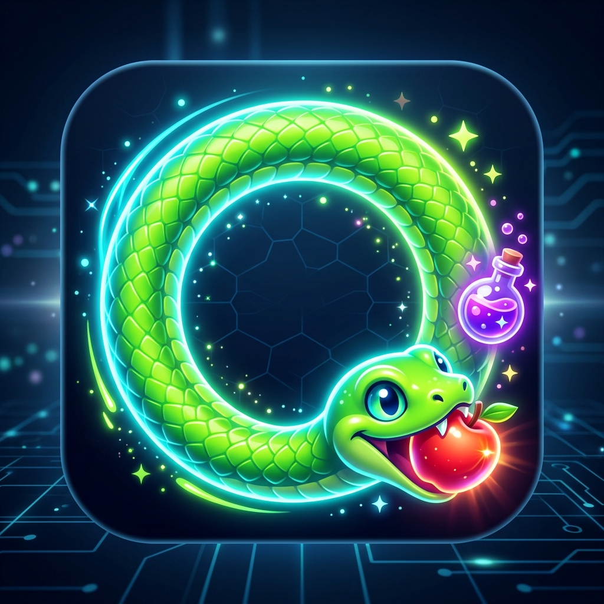
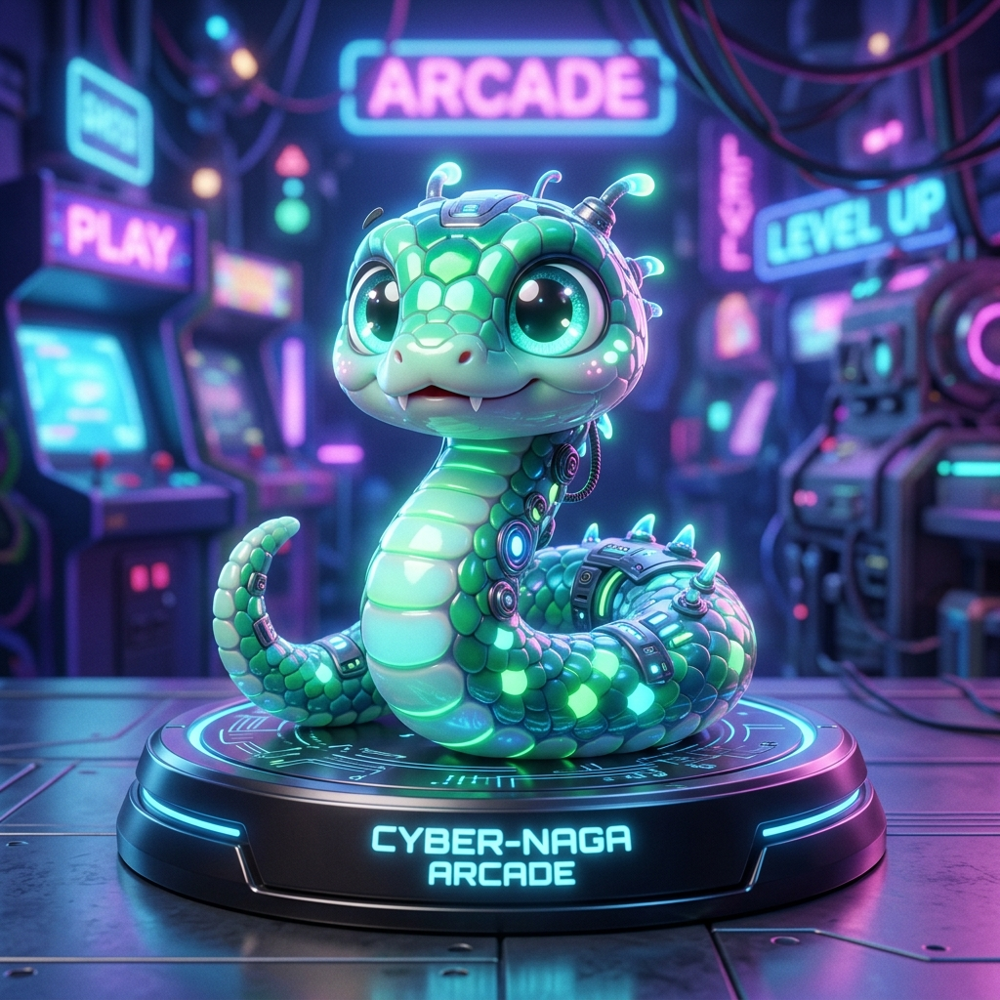

# OuroSnake: 极简赛博·自噬蜕变贪吃蛇 (Cyber Snake)

<p align="center">
  
</p>

<p align="center">
  <b>打破传统的革新玩法 · 4 阶形态蜕变 · 自噬断尾重生 · 视网膜级原生 Canvas 渲染</b>
</p>

<p align="center">
  
  
  
  
</p>

---

## 🎮 游戏简介 (Introduction)

**《极简赛博·自噬蜕变贪吃蛇》** 是一款基于 Canvas 纯原生（0 依赖、极限小包体）打造的微信小游戏与 Web 双端游戏。

不同于传统贪吃蛇“撞到自己即 Game Over”的挫败感，本项目引入了**“自噬断尾”**与**“4 阶形态进化”**核心玩法。随着蛇身变长，你将经历从呆萌肥蛇到修长神龙的华丽蜕变；即使误咬自身，也会触发断尾机制弃车保帅，带来极具张力与爽快感的全新体验。

> 💡 **项目特色**：同时原生支持 **微信小游戏平台** 与 **标准 Web 浏览器（可一键开启 GitHub Pages 线上试玩）**。

---

## ✨ 核心玩法与特色 (Features)

### 1. 🐉 6 阶形态跃迁神化阶梯与视觉立绘 (Evolution Stages & Concept Art)
随着长度递增，网格动态加密，蛇的体态、龙角、龙须、龙翼与龙瞳产生质变（最长突破 300+ 节终极挑战）：

| 阶位 | 境界名称 | 长度与网格 | 头部神话特征与专属龙瞳 | 概念立绘 (Concept Art) |
| :--- | :--- | :--- | :--- | :---: |
| **LV1** | **幼蛇 · 试炼** | 1~29 节<br>`18×18` | 呆萌水灵大圆眼、圆润翠绿蛇头，初生萌态 |  |
| **LV2** | **灵蟒 · 觉醒** | 30~79 节<br>`24×24` | 冰晶琉璃蓝、冷冽灵蛇竖瞳、灵动微光龙须 |  |
| **LV3** | **狂蛟 · 翻海** | 80~149 节<br>`30×30` | 破骨生双角（**蛟角**）、金焰雷霆龙瞳、玄青暗金 |  |
| **LV4** | **冥螭 · 蔽日** | 150~229 节<br>`38×38` | 幽冥黑曜石龙冠、虚空紫炎瞳、暗夜紫电雷纹 |  |
| **LV5** | **应龙 · 巡天** | 230~299 节<br>`44×44` | 璀璨耀阳双翼（**背生金羽**）、赤炎龙瞳、展翼遮天 |  |
| **LV6** | **神龙 · 灭世** | 300+ 节<br>`52×52` | 终极神话！**日月星辰异色瞳**、珊瑚晶角、星云光环、全图粒子 |  |

### 2. ⚡ 5 大自选难度体系 (Selectable Difficulty Tiers)
彻底移除了原本挤占操作空间的 3 档速度固定按钮，在 HUD 顶部加入精致的「难度徽章」，点击随时唤起赛博风格的自选难度选择面板：
* 🟢 **简单 (Novice)**：125ms ➔ 68ms，60 节后开启轻度暗雷（最多 2 颗），休闲练习首选。
* 🟢 **普通 (Standard)**：88ms ➔ 46ms，35 节后标准暗雷（最多 3 颗），1.5x 得分，经典原版街机手感。
* 🟡 **困难 (Veteran)**：60ms ➔ 32ms，20 节后密集暗雷（最多 4 颗），2.2x 得分，电竞级反应。
* 🟠 **噩梦 (Nightmare)**：44ms ➔ 24ms，12 节后高频暗雷（最多 5 颗），3.2x 得分，毫秒闪避走位。
* 🔴 **地狱 (Hell)**：30ms ➔ 16ms 极速狂飙，8 节即布防 6 颗致命暗雷，5.0x 得分，挑战神经反射极限！

### 3. ✂️ 自噬断尾与 💥 赛博红雷暗礁 (Survival Mechanics)
* **自噬断尾**：撞击自身不断命，精准切断被咬节点之后的尾部舍身求存。
* **💥 赛博红雷暗礁**：随自选难度与长度动态涌现高危脉冲暗雷！触碰瞬间腰斩 45% 身体并伴随全屏深红震颤，极限走位绝不容失误！

### 4. 🧪 奇趣道具系统 (Special Items)
* **✂️ 瘦身药水（紫晶）**：长度缩减，紧急脱困降压。
* **★ 狂暴生长（金曜）**：瞬间暴增 3 节长度，加速进化进程。
* **🌀 无界穿墙**：边缘空间折叠穿梭，支持无限循环游走。

### 5. 🕹️ 人体工学双模操控 (Dual Controls)
* **移动端（微信 / 手机浏览器）**：
  * **手势划屏**：屏幕任意区域极速滑动，极短位移（>15px）瞬间响应。
  * **悬浮圆形罗盘 (Circle D-Pad Hub)**：360° 扇形智能分区触控，移除速度按钮后战场垂直视野扩大 40px+。
  * **顶部难度胶囊**：点击唤起自选难度面板，持久化记忆玩家难度偏好。
* **PC 端 / 浏览器**：
  * **方向键** `↑` `↓` `←` `→` 或 `W` `A` `S` `D` 控制转向。
  * **数字键 `1` ~ `5`**：快速切换 简单 / 普通 / 困难 / 噩梦 / 地狱 难度。
  * **空格键 (`Space`)**：随时暂停 / 继续。
  * **`R` 键**：一键重新开局。

### 6. 💎 现代微质感视觉设计 (Visual Aesthetics)
* **克制优雅的深色背景**，配合顶部柔和极光光晕。
* **3D 渐变发光食物**，自带呼吸脉冲动画。
* **灵动蛇眼追踪**：蛇眼瞳孔会根据游动方向自然偏折。
* **视网膜级（Retina）高清渲染**：自动读取 `pixelRatio`，告别像素边缘模糊锯齿。

---

## 🚀 快速开始 (Quick Start)

### 方式一：在微信开发者工具中运行（推荐）

1. **安装工具**：下载并安装 [微信开发者工具](https://developers.weixin.qq.com/miniprogram/dev/devtools/download.html)。
2. **导入项目**：
   - 打开微信开发者工具，点击 **“导入项目”**。
   - 目录选择本项目根目录：`snake-miniprogram`。
   - AppID 选择 **“测试号”**（或填入你自己的小游戏 AppID）。
   - 开发模式选择 **“小游戏”**。
3. **开始游玩与调试**：
   - 模拟器将自动编译并以 60 FPS 流畅运行，可直接点击或划屏体验！

### 方式二：在浏览器中直接体验 (Web Preview / GitHub Pages)

本项目内置轻量适配层 `index.html`：
* **本地试玩**：直接双击打开 `index.html`，或在根目录下通过任意静态服务器启动：
  ```bash
  # Python 3
  python3 -m http.server 8080
  # 访问 http://localhost:8080 即可在浏览器全屏游玩
  ```
* **一键开启 GitHub Pages 在线游玩**：
  1. 将仓库推送到 GitHub。
  2. 进入仓库 **Settings** -> **Pages**。
  3. **Branch** 选择 `main` / `master`，路径选择 `/(root)` 并保存。
  4. 稍等片刻，即可得到一个公开可玩的游戏网址：**https://chase-xue.github.io/ourosnake/** ，分享给朋友直接在手机/电脑浏览器中玩！

---

## 📁 目录结构 (Project Structure)

```text
ourosnake/
├── avatar.jpg               # 游戏 Logo / 图标素材
├── game.js                  # 游戏核心逻辑（Canvas渲染、循环、断尾、进化状态机）
├── game.json                # 微信小游戏全局配置
├── project.config.json      # 微信开发者工具工程配置（已脱敏为测试号）
├── index.html               # 纯 Web / GitHub Pages 在线试玩适配器
├── .gitignore               # Git 忽略文件规则（防止本地私有配置泄露）
├── LICENSE                  # MIT 开源许可证
├── CONTRIBUTING.md          # 社区贡献指南
└── README.md                # 项目详细说明文档
```

---

## ⚙️ 核心参数自定义 (Customization)

所有玩法与视觉参数均在 [game.js](game.js) 顶部清晰集中定义，方便二次开发定制：

```javascript
// 6 阶形态蜕变长线成长阶梯：幼蛇 ➔ 灵蟒 ➔ 狂蛟 ➔ 冥螭 ➔ 应龙 ➔ 灭世神龙
const STAGES = [
  { level: 1, name: '幼蛇', tag: 'LV1 试炼', grid: 18, minLen: 1 },
  { level: 2, name: '灵蟒', tag: 'LV2 觉醒', grid: 24, minLen: 30 },
  { level: 3, name: '狂蛟', tag: 'LV3 翻海', grid: 30, minLen: 80 },
  { level: 4, name: '冥螭', tag: 'LV4 蔽日', grid: 38, minLen: 150 },
  { level: 5, name: '应龙', tag: 'LV5 巡天', grid: 44, minLen: 230 },
  { level: 6, name: '神龙', tag: 'LV6 灭世', grid: 52, minLen: 300 }
];

// 5 大自选难度体系 (简单 / 普通 / 困难 / 噩梦 / 地狱)
const DIFFICULTY_CONFIGS = {
  EASY:      { name: '简单', baseSpeed: 125, minSpeed: 68, maxMines: 2, scoreMult: 1.0 },
  NORMAL:    { name: '普通', baseSpeed: 88,  minSpeed: 46, maxMines: 3, scoreMult: 1.5 },
  HARD:      { name: '困难', baseSpeed: 60,  minSpeed: 32, maxMines: 4, scoreMult: 2.2 },
  NIGHTMARE: { name: '噩梦', baseSpeed: 44,  minSpeed: 24, maxMines: 5, scoreMult: 3.2 },
  HELL:      { name: '地狱', baseSpeed: 30,  minSpeed: 16, maxMines: 6, scoreMult: 5.0 }
};
```

---

## 🤝 参与贡献 (Contributing)

我们由衷欢迎每一位开发者的建议、Issue 与 PR！
详情请查阅 [CONTRIBUTING.md](CONTRIBUTING.md)。

---

## 📄 开源许可证 (License)

本项目遵循 [MIT License](LICENSE) 开源协议。无论是个人学习、改进二次发布还是衍生创作，皆可自由使用。
